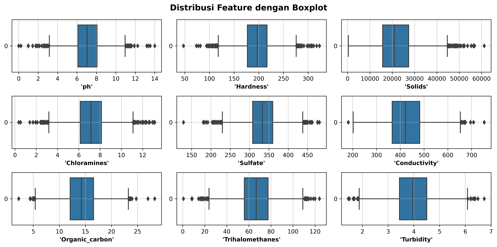
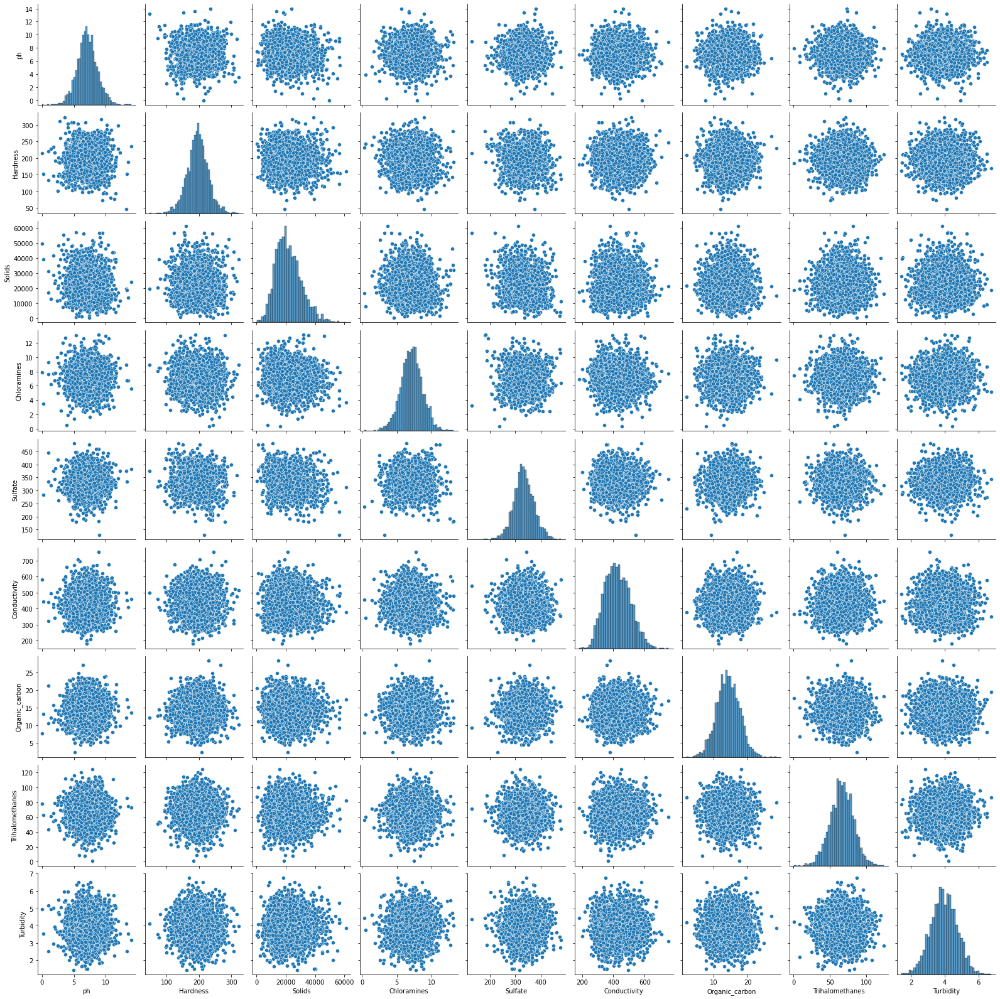
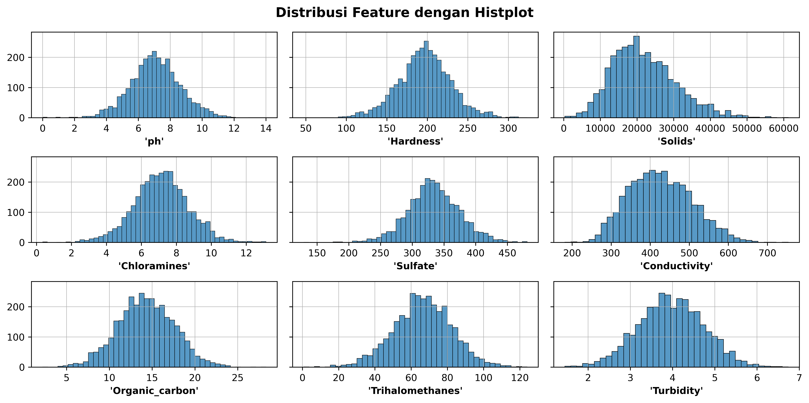
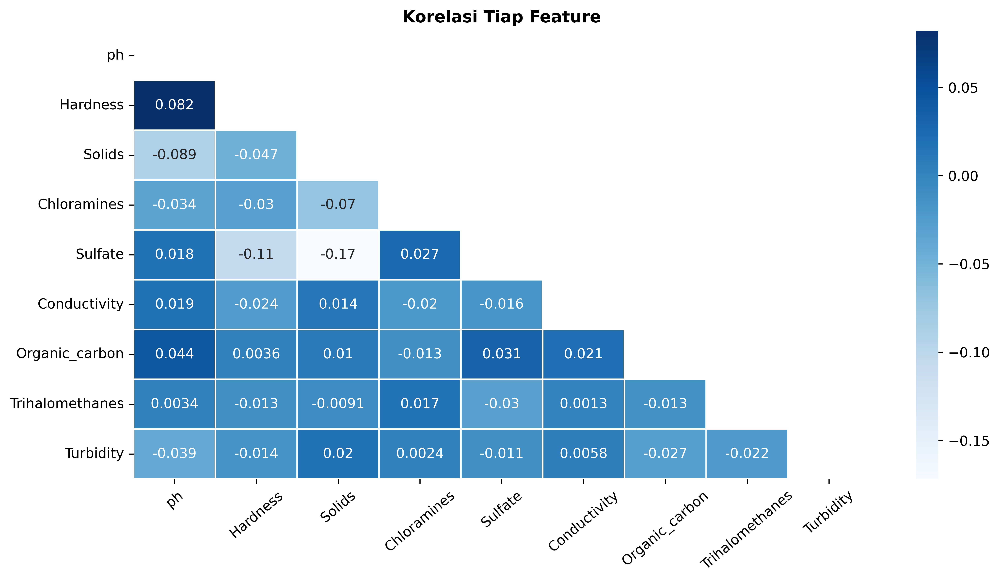
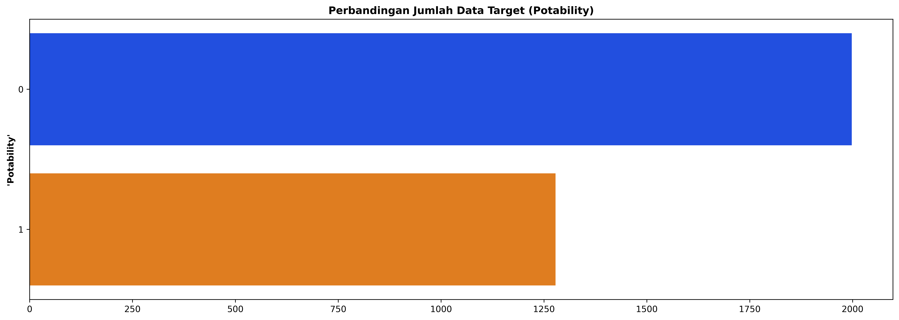

# Project 4: Machine Learning - Water Potability


Photo by <a href="https://unsplash.com/@manuschwendener?utm_source=unsplash&utm_medium=referral&utm_content=creditCopyText">Manu Schwendener</a> on <a href="https://unsplash.com/s/photos/water-drink?utm_source=unsplash&utm_medium=referral&utm_content=creditCopyText">Unsplash</a>

## Overview
1. Membuat model Machine Learning dengan algoritma Random Forest
2. Dataset berasal dari kaggle.com dengan nama 'Water Quality', disusun oleh Aditya Kadiwal
3. Dataset memiliki 10 kolom
    - **'ph'**
    - **'Hardness'**
    - **'Solids'**
    - **'Chloramines'**
    - **'Sulfate'**
    - **'Conductivity'**
    - **'Organic_carbon'**
    - **'Trihalomethanes'**
    - **'Turbidity'**
    - **'Potability'**
   
   Untuk melihat keterangan setiap kolom, bisa di cek [disini](https://www.kaggle.com/adityakadiwal/water-potability)

4. Terdapat 6 tahapan dalam mengolah data dan membuat model, yaitu:
    - Import Libraries & Dataset
    - Exploratory Data Analysis
    - Data Preprocessing
    - Splitting & Modeling
    - Model Evaluation
    - Save Model
    
    Tahapan di atas bukan merupakan tahapan yang baku, tahapan dapat disesuaikan berdasarkan karakteristik data dan studi kasus
    
5. Project menggunakan dataset berasal kaggle, disusun oleh Aditya Kadiwal. Dapat diakses [disini](https://www.kaggle.com/adityakadiwal/water-potability)
 
## 1. Import Libraries & Dataset
```
import pandas as pd
import numpy as np
import matplotlib.pyplot as plt
import seaborn as sns

from sklearn.model_selection import train_test_split
from sklearn.ensemble import RandomForestClassifier

from sklearn.pipeline import Pipeline
from sklearn.model_selection import GridSearchCV

from sklearn.metrics import classification_report
from sklearn.metrics import confusion_matrix
```

```
df = pd.read_csv('./data/water_potability.csv')
df.head()
```


```
df.info()
```


```
df.isnull().sum()
```


## 2. Exploratory Data Analysis
Memasukkan terlebih dahulu semua kolom kecuali data target ke dalam variabel tertentu untuk memudahkan proses EDA
```
columns = [col for col in df.columns[:-1]]
```

Visualisasi Boxplot & Swarmplot
```
fig, ax = plt.subplots(3, 3, figsize=(12, 6), dpi=600)
ax = ax.flatten()
plt.suptitle("Distribusi Feature dengan Boxplot", fontsize=14, fontweight='bold')

for col, index in zip(columns, range(len(columns))):
    sns.boxplot(ax=ax[columns.index(col)], data=df[col], orient='h')
    ax[columns.index(col)].grid(linewidth=0.5)
    ax[columns.index(col)].set_xlabel(f"'{col}'", fontsize=10, fontweight='bold')
    ax[columns.index(col)].set_ylabel(None)

plt.tight_layout()
plt.show()
```


```
fig, ax = plt.subplots(3, 3, figsize=(12, 8), dpi=600)
ax = ax.flatten()
plt.suptitle("Swarmplot", fontsize=14, fontweight='bold')

for col, index in zip(columns, range(len(columns))):
    sns.swarmplot(ax=ax[columns.index(col)], data=df[col], orient='h', size=1.2)
    ax[columns.index(col)].grid(linewidth=0.5)
    ax[columns.index(col)].set_xlabel(f"'{col}'", fontsize=10, fontweight='bold')

plt.tight_layout()
plt.show()
```


Visualisasi dengan Pairplot
```
sns.pairplot(df[columns]);
```


Melihat lebih jelas distribusi data dengan Histplot
```
fig, ax = plt.subplots(3, 3, figsize=(12, 6), dpi=600, sharey=True)
ax = ax.flatten()
plt.suptitle("Distribusi Feature dengan Histplot", fontsize=14, fontweight='bold')

for col, index in zip(columns, range(len(columns))):
    sns.histplot(ax=ax[columns.index(col)], data=df[col])
    ax[columns.index(col)].grid(linewidth=0.5)
    ax[columns.index(col)].set_xlabel(f"'{col}'", fontsize=10, fontweight='bold')
    ax[columns.index(col)].set_ylabel(None)

plt.tight_layout()
plt.show()
```


Melihat lebih jelas korelasi tiap data dengan Heatmap
```
fig, ax = plt.subplots(figsize=(12, 6), dpi=600)
mask = np.triu(df[columns].corr())

sns.heatmap(df[columns].corr(), annot=True, cmap='Blues', mask=mask, linewidths=1)

plt.xticks(rotation=40)
plt.title("Korelasi Tiap Feature", fontsize=12, fontweight='bold')
plt.show()
```


Melihat perbandingan jumlah data target
```
fig, ax = plt.subplots(figsize=(18, 6), dpi=600)
sns.countplot(y='Potability', data=df, palette='bright')
plt.title('Perbandingan Jumlah Data Target (Potability)', fontweight='bold')
plt.ylabel("'Potability'", fontweight='bold')
plt.xlabel(None)
plt.show()
```


## 3. Data Preprocessing
### 3.1 Handling Missing Value
### 3.2 Remove Outliers
### 3.3 Balancing Data Target
### 3.4 Feature Scaling
## 4. Splitting & Modeling
## 5. Model Evaluation
### 5.1 Hyperparameter Tuning dengan GridSeacrhCV
### 5.2 Confusion Matrix
## 6. Save Model
