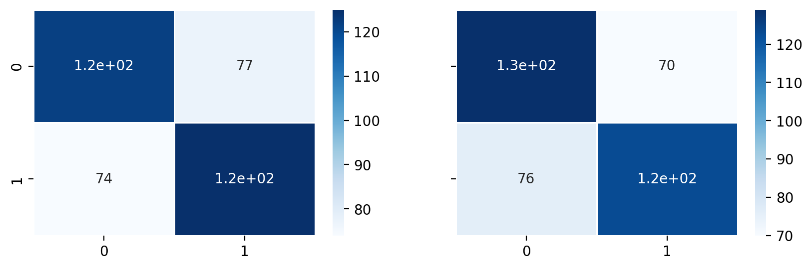

# Project 4: Machine Learning - Water Potability


Photo by <a href="https://unsplash.com/@manuschwendener?utm_source=unsplash&utm_medium=referral&utm_content=creditCopyText">Manu Schwendener</a> on <a href="https://unsplash.com/s/photos/water-drink?utm_source=unsplash&utm_medium=referral&utm_content=creditCopyText">Unsplash</a>

## Overview
1. Membuat model Machine Learning dengan algoritma Random Forest
2. Dataset berasal dari kaggle.com dengan nama 'Water Quality', disusun oleh Aditya Kadiwal
3. Dataset memiliki 10 kolom
    - **'ph'**
    - **'Hardness'**
    - **'Solids'**
    - **'Chloramines'**
    - **'Sulfate'**
    - **'Conductivity'**
    - **'Organic_carbon'**
    - **'Trihalomethanes'**
    - **'Turbidity'**
    - **'Potability'**
   
   Untuk melihat keterangan setiap kolom, bisa di cek [disini](https://www.kaggle.com/adityakadiwal/water-potability)

4. Terdapat 6 tahapan dalam mengolah data dan membuat model, yaitu:
    - Import Libraries & Dataset
    - Exploratory Data Analysis
    - Data Preprocessing
    - Splitting & Modeling
    - Model Evaluation
    - Save Model
    
    Tahapan di atas bukan merupakan tahapan yang baku, tahapan dapat disesuaikan berdasarkan karakteristik data dan studi kasus
    
5. Project menggunakan dataset berasal kaggle, disusun oleh Aditya Kadiwal. Dapat diakses [disini](https://www.kaggle.com/adityakadiwal/water-potability)
 
## 1. Import Libraries & Dataset
```
import pandas as pd
import numpy as np
import matplotlib.pyplot as plt
import seaborn as sns

from sklearn.model_selection import train_test_split
from sklearn.ensemble import RandomForestClassifier

from sklearn.pipeline import Pipeline
from sklearn.model_selection import GridSearchCV

from sklearn.metrics import classification_report
from sklearn.metrics import confusion_matrix
```

```
df = pd.read_csv('./data/water_potability.csv')
df.head()
```


```
df.info()
```


```
df.isnull().sum()
```


## 2. Exploratory Data Analysis
Memasukkan terlebih dahulu semua kolom kecuali data target ke dalam variabel tertentu untuk memudahkan proses EDA
```
columns = [col for col in df.columns[:-1]]
```

- Visualisasi Boxplot & Swarmplot
```
fig, ax = plt.subplots(3, 3, figsize=(12, 6), dpi=600)
ax = ax.flatten()
plt.suptitle("Distribusi Feature dengan Boxplot", fontsize=14, fontweight='bold')

for col, index in zip(columns, range(len(columns))):
    sns.boxplot(ax=ax[columns.index(col)], data=df[col], orient='h')
    ax[columns.index(col)].grid(linewidth=0.5)
    ax[columns.index(col)].set_xlabel(f"'{col}'", fontsize=10, fontweight='bold')
    ax[columns.index(col)].set_ylabel(None)

plt.tight_layout()
plt.show()
```


Berdasarkan visualisasi di atas, terdapat Outliers di semua kolom.

```
fig, ax = plt.subplots(3, 3, figsize=(12, 8), dpi=600)
ax = ax.flatten()
plt.suptitle("Swarmplot", fontsize=14, fontweight='bold')

for col, index in zip(columns, range(len(columns))):
    sns.swarmplot(ax=ax[columns.index(col)], data=df[col], orient='h', size=1.2)
    ax[columns.index(col)].grid(linewidth=0.5)
    ax[columns.index(col)].set_xlabel(f"'{col}'", fontsize=10, fontweight='bold')

plt.tight_layout()
plt.show()
```


- Visualisasi dengan Pairplot
```
sns.pairplot(df[columns]);
```


- Melihat lebih jelas distribusi data dengan Histplot
```
fig, ax = plt.subplots(3, 3, figsize=(12, 6), dpi=600, sharey=True)
ax = ax.flatten()
plt.suptitle("Distribusi Feature dengan Histplot", fontsize=14, fontweight='bold')

for col, index in zip(columns, range(len(columns))):
    sns.histplot(ax=ax[columns.index(col)], data=df[col])
    ax[columns.index(col)].grid(linewidth=0.5)
    ax[columns.index(col)].set_xlabel(f"'{col}'", fontsize=10, fontweight='bold')
    ax[columns.index(col)].set_ylabel(None)

plt.tight_layout()
plt.show()
```


Semua kolom cenderung terdistribusi normal, kecuali kolom 'Solids' yang memiliki distrbusi **skewed right**.

- Melihat lebih jelas korelasi tiap data dengan Heatmap
```
fig, ax = plt.subplots(figsize=(12, 6), dpi=600)
mask = np.triu(df[columns].corr())

sns.heatmap(df[columns].corr(), annot=True, cmap='Blues', mask=mask, linewidths=1)

plt.xticks(rotation=40)
plt.title("Korelasi Tiap Feature", fontsize=12, fontweight='bold')
plt.show()
```


Berdasarkan visualisasi di atas, tidak adanya kolom yang saling berkorelasi kuat baik itu korelasi positif maupun negatif

- Melihat perbandingan jumlah data target
```
fig, ax = plt.subplots(figsize=(18, 6), dpi=600)
sns.countplot(y='Potability', data=df, palette='bright')
plt.title('Perbandingan Jumlah Data Target (Potability)', fontweight='bold')
plt.ylabel("'Potability'", fontweight='bold')
plt.xlabel(None)
plt.show()
```


Jumlah data target yang berlabel 0 lebih banyak dibanding dengan data yang berlabel 1

## 3. Data Preprocessing
### 3.1 Handling Missing Value
Berdasarkan pengamatan Histplot, semua feature (yang kesemuanya feature numerik) memiliki data yang hampir terditribusi normal sehingga data yang bernilai kosong dapat diganti dengan nilai mean.
```
df.fillna(df.mean(), inplace=True)
```
```
df.tail()
```


### 3.2 Remove Outliers
Dalam visualisasi sebelumnya, khususnya pada visualisasi Boxplot, banyak ditemukan Outliers pada setiap kolom. Outliers akan dihilangkan berdasarkan IQR.
```
Q1 = df.quantile(0.25)
Q3 = df.quantile(0.75)

IQR = Q3 - Q1
print(IQR)
```


Dimensi dataset sebelum Outliers dihilangkan
```
df.shape
```


```
df = df[~((df < (Q1 - 1.5 * IQR)) | (df > (Q3 + 1.5 * IQR))).any(axis=1)]
```
Dimensi dataset setelah Outliers dihilangkan

```
df.shape
```


### 3.3 Balancing Data Target
Berdasarkan visualisasi Countplot terlihat bahwa data target tidak seimbang (imbalance target data), data yang bernilai 0 lebih banyak dari data yang bernilai 1. Dengan begitu perlu dilakukannya metode balancing data dengan undersampling agar dapat meningkatkan kinerja model nantinya. Undersampling adalah membuang data mayoritas agar sama dengan jumlah data minoritas pada kelas tertentu. Dalam kasus ini, data mayoritas ialah data target yang ber-label 0.
```
negatif = df.loc[df['Potability'] == 0]
positif = df.loc[df['Potability'] == 1]

print(f"Jumlah data target berlabel negatif:\t{len(negatif)}")
print(f"Jumlah data target berlabel positif:\t{len(positif)}")
```


```
negatif = negatif[:len(positif)]

print("Setelah Undersampling")
print(f"Jumlah data target berlabel negatif:\t{len(negatif)}")
print(f"Jumlah data target berlabel positif:\t{len(positif)}")
```


```
df = pd.concat([negatif, positif], ignore_index=True)
```

### 3.4 Feature Scaling
Feature scaling dengan menggunakan MinMaxScaler agar data memiliki rentang nilai yang sama untuk setiap kolomnya.
```
scaler = MinMaxScaler()
scaled_data = scaler.fit_transform(df)

scaled_data
```


```
df = pd.DataFrame(scaled_data, index=df.index, columns=df.columns)

df.head()
```


## 4. Splitting & Modeling
```
X = df.drop(columns='Potability')
y = df['Potability']
```
```
X_train, X_test, y_train, y_test = train_test_split(X, y, test_size=0.2, stratify=y, random_state=42)
```
```
model = RandomForestClassifier()
model.fit(X_train, y_train)
```


```
model.score(X_test, y_test)
```


```
print(classification_report(y_test, model.predict(X_test)))
```


## 5. Model Evaluation

Mmebuat model baru yang di-tuning dengan **GridSearchCV**

### 5.1 Hyperparameter Tuning dengan GridSeacrhCV
```
pipeline = Pipeline([
    ('algo', RandomForestClassifier())
])
```
```
parameters = {
    'algo__max_depth': [10, 20, 30, 40, None],
    'algo__bootstrap': [True, False],
    'algo__n_estimators': [10, 100, 1000],
    'algo__max_features': ['sqrt', 'log2'],    
}
```
```
new_model = GridSearchCV(pipeline, parameters, cv=4, verbose=1)
new_model.fit(X_train, y_train)
```


```
new_model.score(X_test, y_test)
```


```
new_model.best_params_
```


Membandingkan score model pertama dengan model kedua yang sudah di tuning parameternya

```
model.score(X_test, y_test), new_model.score(X_test, y_test)
```


```
print(classification_report(y_test, new_model.predict(X_test)))
```


### 5.2 Confusion Matrix
```
mx_1 = confusion_matrix(y_test, model.predict(X_test))
mx_2 = confusion_matrix(y_test, new_model.predict(X_test))

fig, ax = plt.subplots(1, 2, figsize=(10, 3), dpi=200, sharey=True)
ax = ax.flatten()
sns.heatmap(mx_1, ax=ax[0], cmap='Blues', annot=True, linewidths=1)
sns.heatmap(mx_2, ax=ax[1], cmap='Blues', annot=True, linewidths=1)

plt.show()
```


Model pertama
```
print(f"True Positif\t:{round(mx_1[0][0] / (mx_1[0][0] + mx_1[0][1]) * 100, 3)}%\t-> {mx_1[0][0]}")
print(f"True Negatif\t:{round(mx_1[1][1] / (mx_1[1][1] + mx_1[1][0]) * 100, 3)}%\t-> {mx_1[1][1]}")
```


Model kedua
```
print(f"True Positif\t:{round(mx_2[0][0] / (mx_2[0][0] + mx_2[0][1]) * 100, 3)}%\t-> {mx_2[0][0]}")
print(f"True Negatif\t:{round(mx_2[1][1] / (mx_2[1][1] + mx_2[1][0]) * 100, 3)}%\t-> {mx_2[0][0]}")
```


## 6. Save Model
```
import pickle
```
```
model_name = "water_potability.rf"
pickle.dump(model, open(model_name, 'wb'))
```
```
new_model_name = "new_water_potability.rf"
pickle.dump(new_model, open(new_model_name, 'wb'))
```
